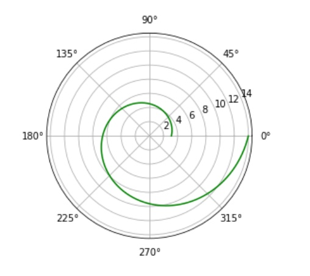
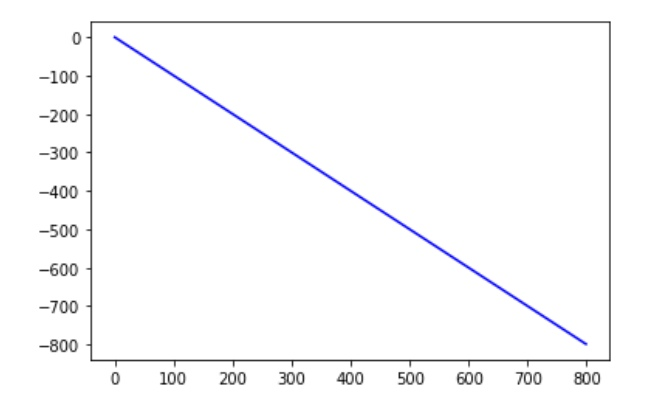
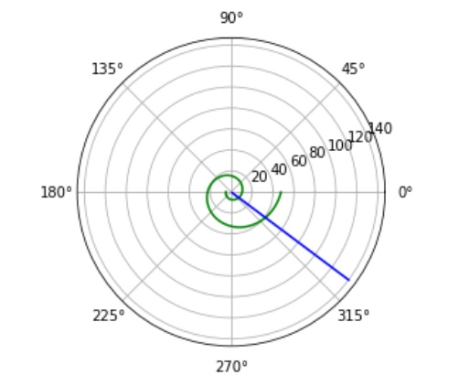

---
## Front matter
lang: ru-RU
title: задача о погоне
author: |Назарьева Алена НФИбд-03-18
institute: |
	\inst{1}RUDN University, Moscow, Russian Federation
date: 2021, 18 february
## Formatting
toc: false
slide_level: 2
theme: metropolis
header-includes:
 - \metroset{progressbar=frametitle,sectionpage=progressbar,numbering=fraction}
 - '\makeatletter'
 - '\beamer@ignorenonframefalse'
 - '\makeatother'
aspectratio: 43
section-titles: true
---
# Цель работы

Изучить и решить задачу о погоне

# Выполнение лабораторной работы

## 1)

Провожу вычисление и получаю x1=16.5/5.3 (для k-x) и x2=16.5/3.3 (для  k+x), где x- неизвестное расстояние.
Тангенсальная скорость в моем случае равна vsqrt(4.3*4.3-1), где v-скорость лодки.

## 2)

Реализую на python функция, описывающая движение катера береговой охраны
def dr(r,tetha):
    dr = r/math.sqrt(17.49)
    return dr
и функция, описывающая движение лодки браконьеров
def f2(t):
    xt=math.tan(fi)*t
    return xt

## 3)

Графики движения катера для первого условия, где тетта0=0 и r0=x1 (рис. -@fig:003)

{ #fig:003 width=70% }

## 4)

Графики движения лодки для первого условия, где тетта0=0 и r0=x1 (рис. -@fig:004)

{ #fig:004 width=70% }

## 5)

Графики движения лодки и катера для первого условия, где тетта0=0 и r0=x1 (рис. -@fig:001)
Точка пересечения r=25, tetha=320

{ #fig:001 width=70% }

## 6)

Графики движения катера для первого условия, где тетта0=-pi и r0=x2 (рис. -@fig:005)

{ #fig:005 width=70% }

## 7)
Графики движения лодки для первого условия, где тетта0=-pi и r0=x2 (рис. -@fig:006)

{ #fig:006 width=70% }

## 8)

Графики движения лодки и катера для первого условия, где тетта0=-pi и r0=x2 (рис. -@fig:002)
Точка пересечения r=40 tetha=320

{ #fig:002 width=70% }

# Выводы

В результате проделанной работы я изучила и решила задачу о погоне для своего варианта
