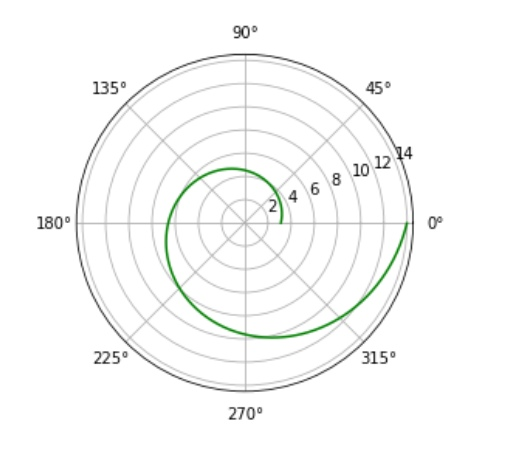
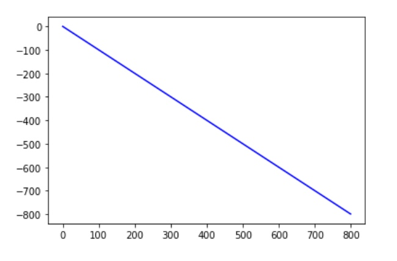
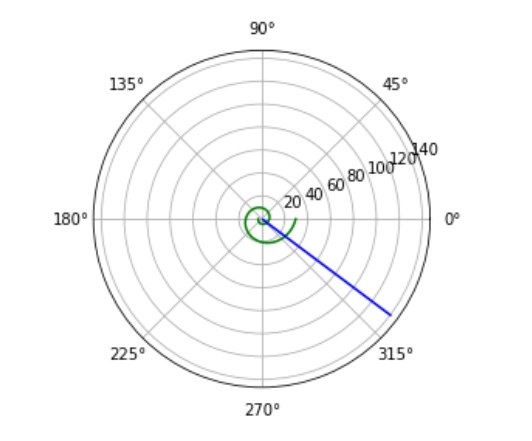
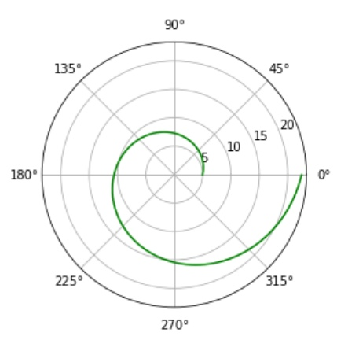
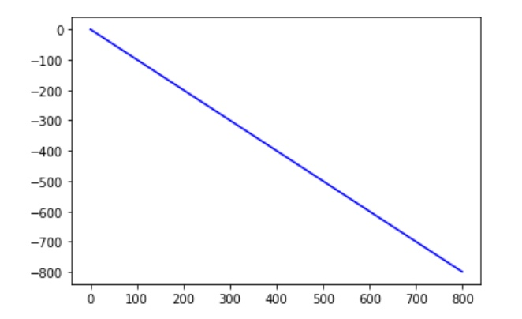
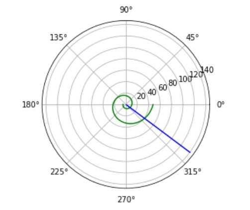

---
# Front matter
lang: ru-RU
title: "Oтчёт по лабораторной работе"
subtitle: "Задача о погоне"
author: "Назарьева Алена Игоревна НФИбд-03-18"

# Formatting
toc-title: "Содержание"
toc: true # Table of contents
toc_depth: 2
lof: true # List of figures
lot: true # List of tables
fontsize: 12pt
linestretch: 1.5
papersize: a4paper
documentclass: scrreprt
polyglossia-lang: russian
polyglossia-otherlangs: english
mainfont: PT Serif
romanfont: PT Serif
sansfont: PT Sans
monofont: PT Mono
mainfontoptions: Ligatures=TeX
romanfontoptions: Ligatures=TeX
sansfontoptions: Ligatures=TeX,Scale=MatchLowercase
monofontoptions: Scale=MatchLowercase
indent: true
pdf-engine: lualatex
header-includes:
  - \linepenalty=10 # the penalty added to the badness of each line within a paragraph (no associated penalty node) Increasing the value makes tex try to have fewer lines in the paragraph.
  - \interlinepenalty=0 # value of the penalty (node) added after each line of a paragraph.
  - \hyphenpenalty=50 # the penalty for line breaking at an automatically inserted hyphen
  - \exhyphenpenalty=50 # the penalty for line breaking at an explicit hyphen
  - \binoppenalty=700 # the penalty for breaking a line at a binary operator
  - \relpenalty=500 # the penalty for breaking a line at a relation
  - \clubpenalty=150 # extra penalty for breaking after first line of a paragraph
  - \widowpenalty=150 # extra penalty for breaking before last line of a paragraph
  - \displaywidowpenalty=50 # extra penalty for breaking before last line before a display math
  - \brokenpenalty=100 # extra penalty for page breaking after a hyphenated line
  - \predisplaypenalty=10000 # penalty for breaking before a display
  - \postdisplaypenalty=0 # penalty for breaking after a display
  - \floatingpenalty = 20000 # penalty for splitting an insertion (can only be split footnote in standard LaTeX)
  - \raggedbottom # or \flushbottom
  - \usepackage{float} # keep figures where there are in the text
  - \floatplacement{figure}{H} # keep figures where there are in the text
---

# Цель работы

Изучить и решить задачу о погоне

# Задание

1. Провести рассуждения и вывод дифференциальных уравнений,
если скорость катера больше скорости лодки в n раз (значение n задайте
самостоятельно)

2. Построить траекторию движения катера и лодки для двух случаев. (Задайте
самостоятельно начальные значения)
Определить по графику точку пересечения катера и лодки

# Теоретическая справка

Постановка задачи

1. Принимает за t0, xл0 - место нахождения лодки браконьеров в момент обнаружения,
xk0=k- место нахождения катера береговой охраны
относительно лодки браконьеров в момент обнаружения лодки.

2. Введем полярные координаты. Считаем, что полюс - это точка обнаружения
лодки браконьеров xл0, а полярная ось r проходит через точку нахождения катера береговой охраны

3. Траектория катера должна быть такой, чтобы и катер, и лодка все время были на одном расстоянии от полюса, только в этом случае траектория катера пересечется с траекторией лодки. Поэтому для начала катер береговой охраны должен двигаться некоторое время прямолинейно, пока не окажется на том же расстоянии от полюса, что и лодка браконьеров. После этого катер береговой охраны должен двигаться вокруг полюса удаляясь от него с той же скоростью, что и лодка браконьеров.

4. Чтобы найти расстояние x (расстояние после которого катер начнет
двигаться вокруг полюса), необходимо составить простое уравнение. Пусть через время
t катер и лодка окажутся на одном расстоянии x от полюса. За это время лодка пройдет x, а катер k-x (или k+x, в зависимости от начального положения катера относительно полюса). Время, за которое они
пройдут это расстояние, вычисляется как x-k/v или k+x/v (во втором случае). Так как время одно и то же, то эти величины одинаковы.
Тогда неизвестное расстояние
x можно найти из следующего уравнения:
x/v=(k-x)/4.3v в первом случае или x/v=(k+x)/4.3v
во втором.
Отсюда мы найдем два значения x1 и x2, задачу будем решать для двух случаев.

5. После того, как катер береговой охраны окажется на одном расстоянии от
полюса, что и лодка, он должен сменить прямолинейную траекторию и начать двигаться вокруг полюса удаляясь от него со скоростью лодки. Для этого скорость катера раскладываем на две составляющие:
радиальная скорость и тангенциальная скорость. Радиальная скорость - это скорость, с которой катер удаляется от полюса. Нам нужно, чтобы эта скорость была равна скорости лодки.
Тангенциальная скорость – это линейная скорость вращения катера относительно полюса. Она равна произведению угловой скорости на радиус

6. Решение исходной задачи сводится к решению системы из двух дифференциальных уравнений с начальными условиями.
Исключая из полученной системы производную по t, можно перейти к следующему уравнению:dr/d0=r/sqrt((4.3)^2*v^2-v^2).
Начальные условия остаются прежними. Решив это уравнение, вы получите
траекторию движения катера в полярных координатах.

# Выполнение лабораторной работы

1. код в python для второго условия:

import math
import numpy as np
from scipy.integrate import odeint
import matplotlib.pyplot as plt
s=16.5
fi=3*math.pi/4
def dr(r,tetha):
    dr = r/math.sqrt(17.49)
    return dr
r0=s/3.3
tetha0=-math.pi
tetha=np.arange(-math.pi, 2*math.pi, 0.01)
r=odeint(dr,r0,tetha)
def f2(t):
    xt=math.tan(fi)*t
    return xt
t=np.arange(0,800,1)
plt.polar(tetha,r,'g')
plt.plot(t,f2(t),'b')
ll = t*t + f2(t)*f2(t)
r2 = np.sqrt(ll)
tetha2 = (np.tan(f2(t)/t))**-1
plt.polar(tetha, r, 'g')
plt.polar(tetha2,r2, 'b')

2. для первого условия:
 import math
 import numpy as np
 from scipy.integrate import odeint
 import matplotlib.pyplot as plt
 s=16.5
 fi=3*math.pi/4
 def dr(r,tetha):
     dr = r/math.sqrt(17.49)
     return dr
 r0=s/5.3
 tetha0=0
 tetha=np.arange(-math.pi, 2*math.pi, 0.01)
 r=odeint(dr,r0,tetha)
 def f2(t):
     xt=math.tan(fi)*t
     return xt
 t=np.arange(0,800,1)
 plt.polar(tetha,r,'g')
 plt.plot(t,f2(t),'b')
 ll = t*t + f2(t)*f2(t)
 r2 = np.sqrt(ll)
 tetha2 = (np.tan(f2(t)/t))**-1
 plt.polar(tetha, r, 'g')
 plt.polar(tetha2,r2, 'b')

3. Графики движения катера для первого условия, где тетта0=0 и r0=x1 (рис. -@fig:003)

{ #fig:003 width=70% }

Графики движения лодки для первого условия, где тетта0=0 и r0=x1 (рис. -@fig:004)

{ #fig:004 width=70% }

результат работы для первого случая (рис. -@fig:001)

{ #fig:001 width=70% }

Графики движения катера для первого условия, где тетта0=-pi и r0=x2 (рис. -@fig:005)

{ #fig:005 width=70% }

Графики движения лодки для первого условия, где тетта0=-pi и r0=x2 (рис. -@fig:006)

{ #fig:006 width=70% }

результат работы для второго случая (рис. -@fig:002)

{ #fig:002 width=70% }
точка пересечения катера и лодки r=25, tetha=320 для первого случая, r=40 tetha=320 для второго случая

# Выводы

В результате проделанной работы я изучила задачу о погоне и решила ее
